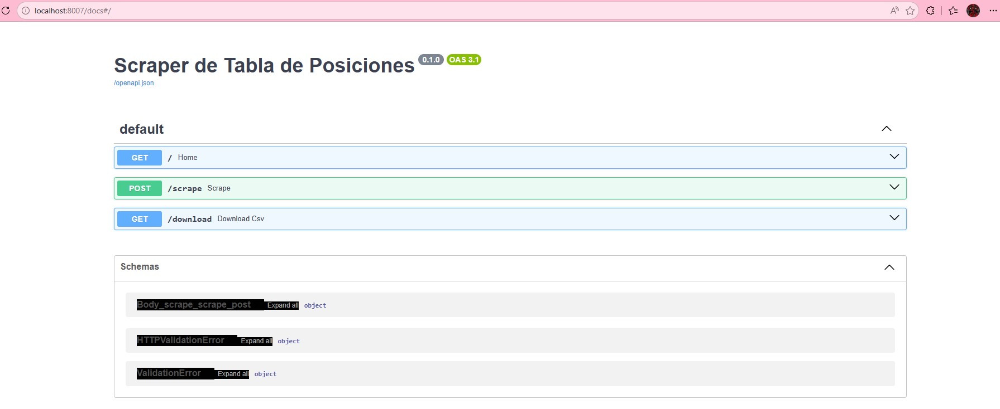
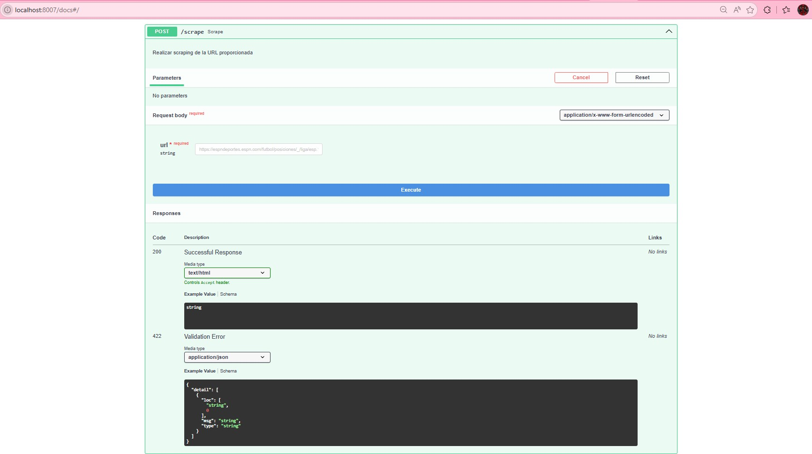
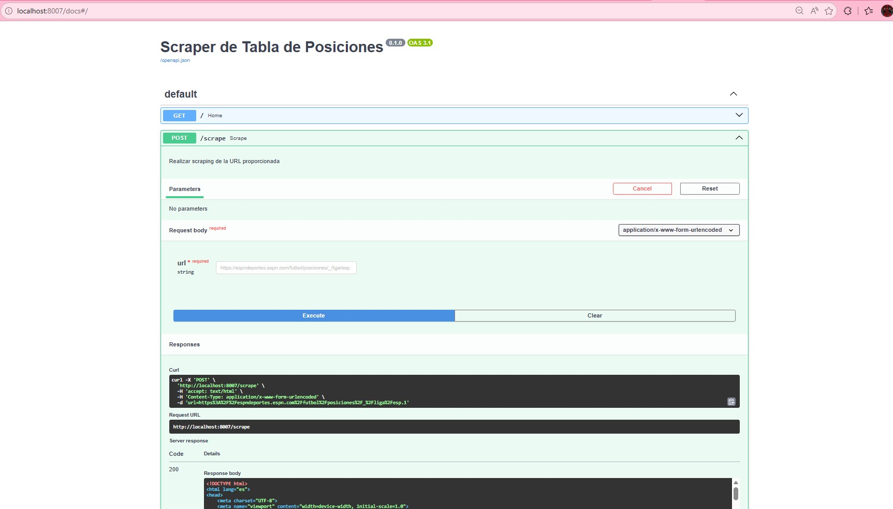
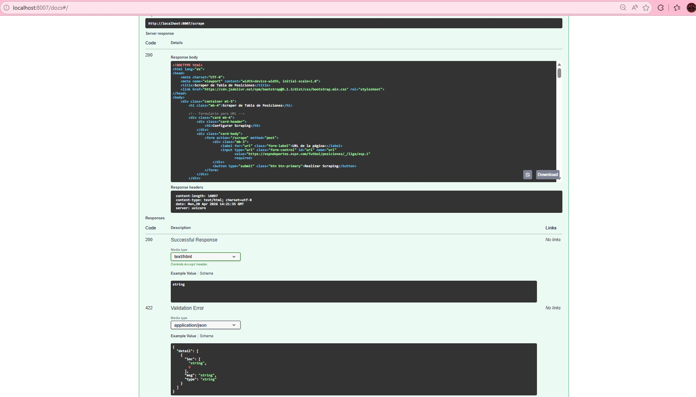
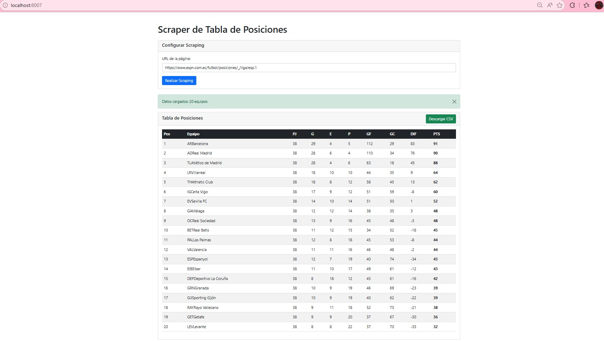
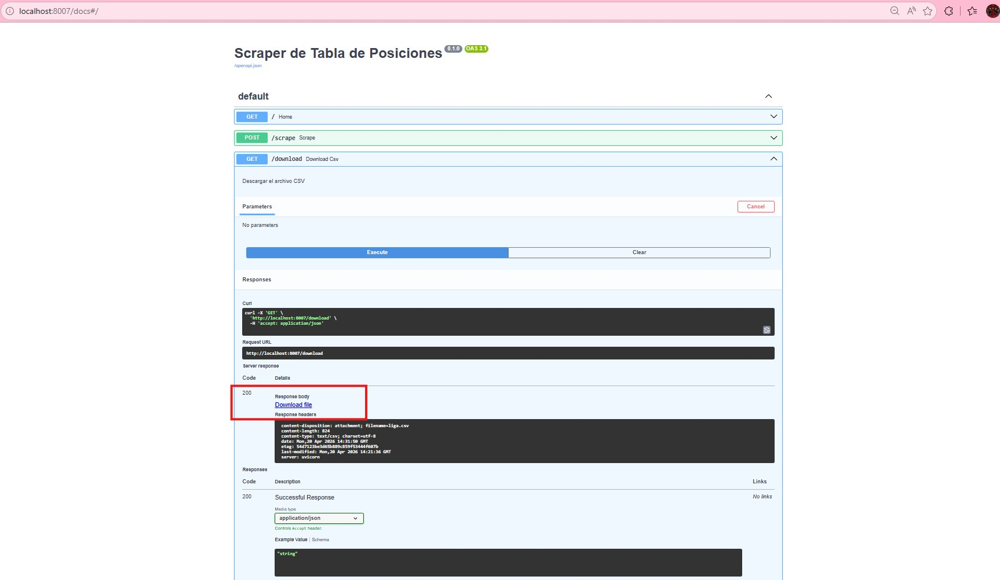

## TEMA: Metodología para la extracción de datos estructurados, procesamiento y almacenamiento seguro.

## Resumen

El presente documento describe el procedimiento técnico para realizar Web Scraping sobre fuentes de datos públicas. Se detalla el flujo de trabajo desde la fase de reconocimiento de la estructura del sitio hasta la persistencia de los datos en formato CSV, integrando controles de buenas prácticas para evitar la detección por sistemas de protección (WAF) y garantizar la integridad de la información obtenida.

## Objetivos
Desde un enfoque de Integridad y Trazabilidad: Diseñar e implementar una metodología de extracción automatizada que garantice la integridad de los datos estructurados mediante el uso de funciones hash (SHA-256) y logs de auditoría, asegurando que la información procesada y almacenada en formato CSV sea una copia fiel y no repudiable de la fuente pública

Desde un enfoque en Evasión Ética y de Disponibilidad: Desarrollar un protocolo de web scraping basado en técnicas de sigilo (Stealth) y rotación de agentes de usuario, con el fin de recolectar datos sin comprometer la disponibilidad de los servicios de la página destino, cumpliendo con las directivas del archivo robots.txt y los estándares éticos de la ciberseguridad.

Desde un punto de vista de Procesamiento Seguro y Sanitización: Establecer un flujo de procesamiento de datos que integre capas de sanitización y validación de esquemas, para eliminar ruido y prevenir la inyección de código malicioso en el almacenamiento final, asegurando que los archivos CSV resultantes sean seguros para su análisis en herramientas de inteligencia de datos.

## Caso: Scraper Web de Tabla de Posiciones - FastAPI

## Descripción
Aplicación web que realiza web scraping de tablas de posiciones de fútbol desde páginas web (como ESPN) y permite visualizar y descargar los datos en formato CSV.

## Características
- ✅ Interfaz web intuitiva con Bootstrap
- ✅ Formulario para ingresar URL de scraping
- ✅ Visualización de datos en tabla HTML
- ✅ Descarga automática de archivo CSV
- ✅ Manejo de errores y mensajes informativos
- ✅ Scraping optimizado con BeautifulSoup

## Tecnologías
- **FastAPI**: Framework web moderno y rápido
- **BeautifulSoup**: Para parsing HTML
- **Pandas**: Para manipulación de datos
- **Jinja2**: Templates HTML
- **Bootstrap**: Interfaz responsiva
- **Uvicorn**: Servidor ASGI

## Instalación

1. **Clonar o descargar el proyecto**
2. **Crear entorno virtual**:
   ```bash
   python -m venv .venv
   ```
3. **Activar entorno virtual**:
   ```bash
   # Windows
   .\.venv\Scripts\activate
   ```
4. **Instalar dependencias**:
   ```bash
   pip install -r requirements.txt
   ```

## Inicio Rápido
# 
**Opción 1: Script automático (Windows)**
```bash
# Doble clic en start.bat
start.bat
```

**Opción 2: Manual**
```bash
# Activar entorno virtual
.\.venv\Scripts\activate

# Ejecutar aplicación
python -m uvicorn main:app --host 127.0.0.1 --port 8007 --reload
```

**Abrir navegador**: `http://127.0.0.1:8007`



3. **Ingresar URL** de la página con tabla de posiciones (por defecto: ESPN Liga Española)



4. **Hacer clic en "Realizar Scraping"**





5. **Visualizar datos** en la tabla y **descargar CSV** si es necesario





## Estructura del Proyecto
```
scraping-paginapublica/
├── main.py                 # Aplicación FastAPI
├── requirements.txt        # Dependencias
├── liga.csv               # Datos scrapeados (generado)
├── templates/
│   └── index.html         # Template principal
├── static/                # Archivos estáticos (CSS, JS)
└── readme.md              # Este archivo
```

## API Endpoints

- `GET /`: Página principal con formulario y datos
- `POST /scrape`: Realizar scraping (recibe URL por formulario)
- `GET /download`: Descargar archivo CSV

## Funcionamiento

La aplicación detecta automáticamente las tablas en la página web y combina:
- **Tabla de equipos**: Nombres y posiciones
- **Tabla de estadísticas**: PJ, G, E, P, GF, GC, DIF, PTS

Los datos se limpian, ordenan por puntos y se muestran en una tabla responsiva.

## Manejo de Errores

- URLs inválidas
- Páginas sin tablas
- Estructuras HTML inesperadas
- Problemas de conexión

## Personalización

Puedes modificar `scrape_football_data()` en `main.py` para adaptar el scraping a otras páginas web con estructuras diferentes.

## Datos extraídos
- Equipo
- Partidos jugados
- Ganados, empatados, perdidos
- Goles a favor y en contra
- Diferencia de goles
- Puntos

## Ejecución
1. Crear entorno virtual:
   python -m venv venv

2. Activar entorno:
   venv\Scripts\activate

3. Instalar dependencias:
   pip install -r requirements.txt

4. Ejecutar:
   python main.py

## Resultado
Se genera un archivo `liga_ecuador.csv` con la tabla de posiciones.

## Coclusión
El Web Scraping es una herramienta poderosa para la inteligencia de amenazas y el análisis de datos masivos. Sin embargo, su ejecución en un entorno de ciberseguridad debe ser quirúrgica, respetando la disponibilidad del servicio de terceros y garantizando que el procesamiento de la información sea transparente y auditable.

## Recomendación
En lugar de un script simple, se sugiere una estructura que garantice la disponibilidad del servicio y la calidad del dato. Esto se logra de la siguiente forma:

1. Implementación de un "Proxy Rotativo" y Gestión de Sesiones
No realizar peticiones directas desde una sola IP. En el ámbito de la ciberseguridad, esto es una mala práctica porque facilita el rastreo y bloqueo.
•	Acción: Utilizar una red de proxies o servicios que rotan la dirección IP en cada petición.
•	Valor: Simular un tráfico distribuido legítimo, evitando que los sistemas de detección de intrusos (IDS) marquen la actividad como un ataque de raspado agresivo.
2. Validación de Esquema (Data Contract)
La disciplina y prevencion son vitales. No hay que asumir que el sitio web siempre tendrá la misma estructura.
•	Acción: Antes de guardar en el CSV, implementar una capa de validación (usando librerías como Pydantic en Python). Si el sitio cambia una etiqueta HTML, el script debe detenerse y generar una alerta en lugar de guardar datos corruptos o vacíos.
•	Valor: Garantiza la integridad del repositorio de datos resultante.
3. El uso de "Headless Browsers" con Sigilo
Si la página pública utiliza protecciones modernas, un simple GET de HTTP no será suficiente.
•	Acción: Se recomienda utilizar Playwright en modo headless (sin interfaz gráfica) junto con el plugin stealth.
•	Valor: Esto permite ejecutar JavaScript, interactuar con menús desplegables y superar retos básicos de bot-detection que detendrían a un programador novato.


## Consideraciones de Seguridad y Riesgos

Ofuscación de Identidad: Uso de rotación de User-Agents y Proxies residenciales si la arquitectura del sitio es altamente defensiva.

Integridad de Datos: Implementación de sumas de verificación (Hashing) para asegurar que el archivo CSV no sea alterado tras su generación.

Privacidad (GDPR/LOPD): Asegurar que no se capturen datos de carácter personal (PII) sin el consentimiento explícito, incluso en fuentes públicas.